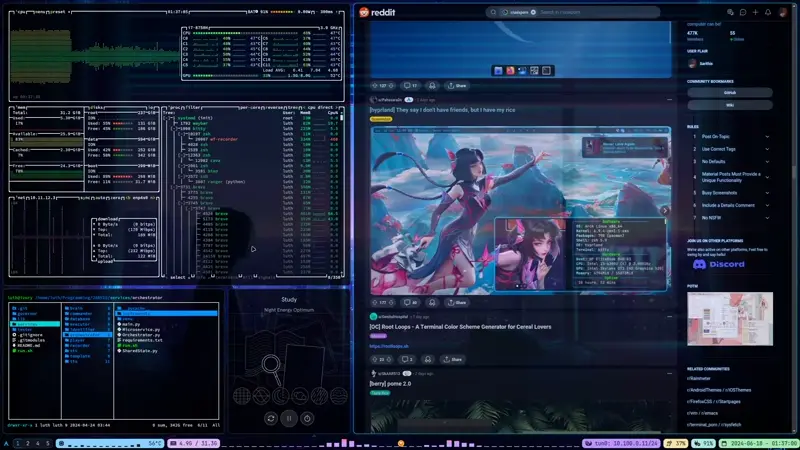

# Dots 💎

> A curated collection of my personalized configuration files (dotfiles) for **Hyprland**, **Kitty**, **Waybar**, **Neovim**, and useful helper scripts.

<p align="center">
  <a href="https://github.com/TKasperczyk/dots/actions"></a>
  <a href="https://github.com/TKasperczyk/dots/blob/main/LICENSE"></a>
</p>

---

## 🎥 Preview

[]

---

## 🚀 Features

* **Hyprland**: Animated workspaces, custom binds, decors & themed window rules
* **Kitty**: Powerline fonts, opacity, emoji fallback & streamlined keybindings
* **Waybar**: Modular status bar + custom CSS for consistent theming
* **Neovim**: Lazy-loaded plugins (LSP, Telescope, Treesitter, completion, Git, themes)
* **Scripts**: Handy Bash/Python helpers (audio sink cycling, TV control, etc.)
* **Consistent Theme**: Unified look across all components

---

## 🛠️ Prerequisites

* **OS**: Linux with **Wayland** (Hyprland)
* **Tools**:

  ```bash
  sudo pacman -S hyprland kitty waybar neovim ...
  ```
* **Extras**: `pactl`, `brightnessctl`, `slurp`, `grim`, Python (for helper scripts)

---

## ⚡ Installation

Clone this repo and link your configs:

```bash
# 1. Clone the repo
git clone https://github.com/TKasperczyk/dots.git ~/dots

# 2. Remove old configs (if any) and link new ones
cd ~/dots
rm -rf ~/.config/hypr ~/.config/kitty ~/.config/waybar ~/.config/nvim ~/.config/waypaper
ln -s ~/dots/.config/hypr     ~/.config/hypr
ln -s ~/dots/.config/kitty   ~/.config/kitty
ln -s ~/dots/.config/waybar  ~/.config/waybar
ln -s ~/dots/.config/nvim    ~/.config/nvim
ln -s ~/dots/.config/waypaper ~/.config/waypaper

# 3. Restart or reload components
hyprctl reload          # Hyprland
systemctl --user restart waybar  # Waybar
echo "Open Kitty to apply theme"
```

---

## 📝 Usage

* **Hyprland**: `hyprctl reload` or logout/login
* **Waybar**: `systemctl --user restart waybar`
* **Kitty**: Launch or restart your terminal
* **Neovim**: `nvim` (plugins auto-managed by `lazy.nvim`)
* **Scripts**: Run via binds or directly (`changeSoundCard.sh`, `test.py` TV control)

---

## 🎨 Customization

Adjust any settings in the corresponding folder under `.config/`:

* `hypr/hyprland.conf`
* `kitty/kitty.conf`
* `waybar/config` & `waybar/style.css`
* `nvim/init.lua` & `lua/plugins/`
* `waypaper/config.ini`
* `scripts/` (helper utilities)

---
